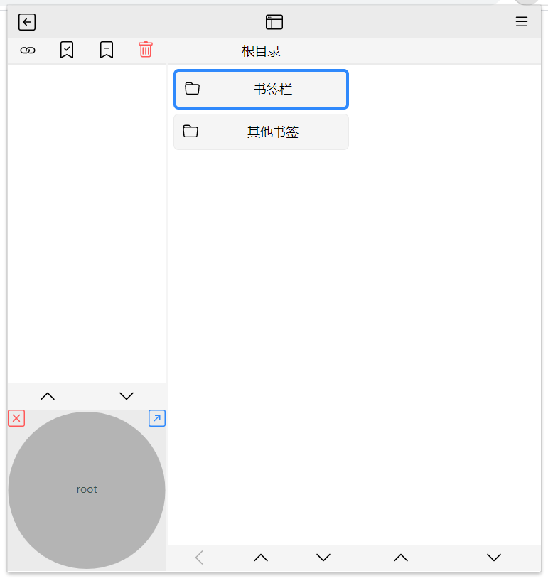
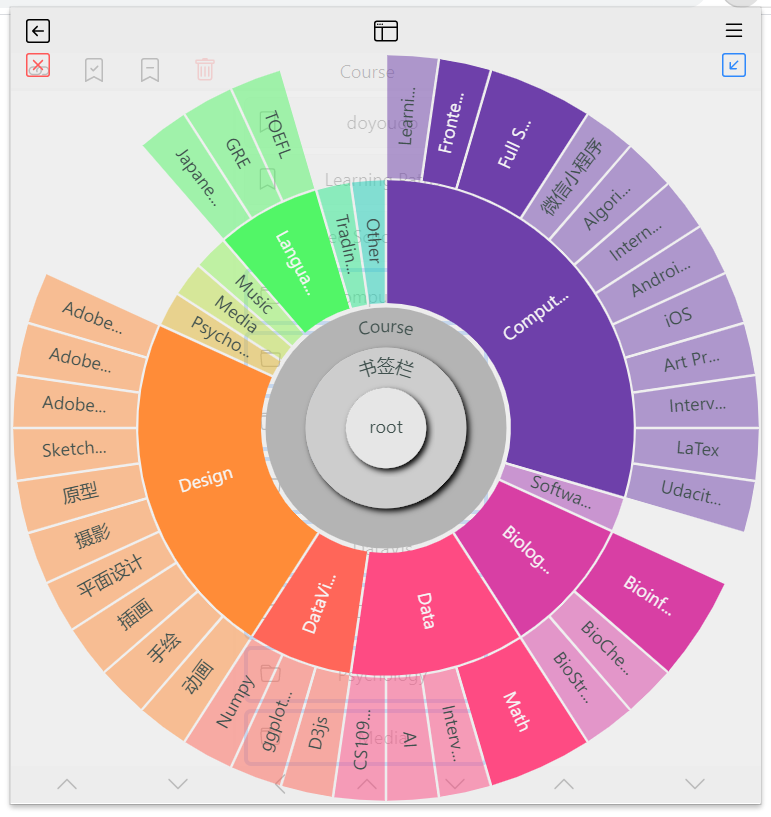
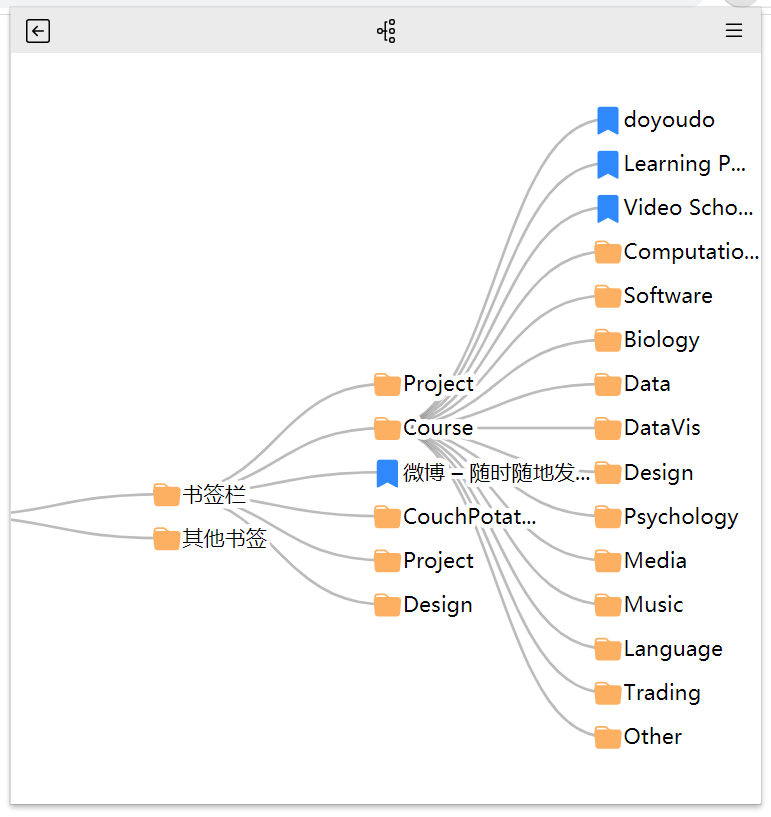

# TagDown

    

An Enhance Bookmarks Manager

## Introduction

TagDown is a browser extension to manage bookmarks. Power by D3.js to visualize the hierarchy data, you can browse the bookmarks fast and conveniently.

## Install

1. download the latest version [BookDown](https://github.com/Benbinbin/BookDown/releases) `zip` file and unzip it
2. follow the [instruction](https://developer.chrome.com/docs/extensions/mv2/getstarted/#manifest) to install the unpacked extension:
    * open Chrome and navigate to `chrome://extensions`
    * Enable **Developer Mode** by clicking the toggle switch next to Developer mode.
    * Click the `LOAD UNPACKED` button and select the unzip directory `dist`.

3. feel free to play around!

## version

* [v1.0.0](https://github.com/Benbinbin/BookDown/releases/tag/v1.0.0) provide two modes to visualize the hierarchy data, you can browse the bookmarks fast and conveniently.

## Todos
- [ ] add bookmark
- [ ] add tags and memo to describe bookmark
- [ ] preview mode of bookmark
- [ ] the batch management page of bookmarks
- [ ] share bookmarks group